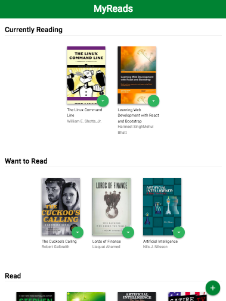

# MyReads: A Book Tracking App

This project is part of the Udacity Front-End Nanodegree.

A template with static code is refactored using React, to add interactivity to the app.

## Porject Overview

A bookshelf app that allows you to select and categorize books you have read, are currently reading, or want to read. An API server and client library is provided and will be used to persist information as you interact with the application.

Each book has a control that lets you select the shelf for that book. When you select a different shelf, the book moves there.
The main page also has a link to /search, a search page that allows you to find books to add to your library.

The search page has a text input that may be used to find books. As the value of the text input changes, the books that match that query are displayed on the page, along with a control that lets you add the book to your library.

When you navigate back to the main page from the search page, you instantly see all of the selections you made on the search page in your library.

## How To Run The Application

1. Download or clone this repository.
2. From inside the new directory:
    * install all project dependencies with `npm install`
    * start the server with `npm start`
3. Visit the site in your browser at http://localhost:3000.

## Important

The backend API uses a fixed set of cached search results and is limited to a particular set of search terms, which can be found in [SEARCH_TERMS.md](SEARCH_TERMS.md). That list of terms are the _only_ terms that will work with the backend, so don't be surprised if your searches for Basket Weaving or Bubble Wrap don't come back with any results.

## Credits

The starter code is from [Udacity](https://github.com/udacity/reactnd-project-myreads-starter).

## License

MIT License

Copyright (c) 2018 Lucia Gonzalez Moscoso

Permission is hereby granted, free of charge, to any person obtaining a copy of this software and associated documentation files (the "Software"), to deal in the Software without restriction, including without limitation the rights to use, copy, modify, merge, publish, distribute, sublicense, and/or sell copies of the Software, and to permit persons to whom the Software is furnished to do so, subject to the following conditions:

The above copyright notice and this permission notice shall be included in all copies or substantial portions of the Software.

THE SOFTWARE IS PROVIDED "AS IS", WITHOUT WARRANTY OF ANY KIND, EXPRESS OR IMPLIED, INCLUDING BUT NOT LIMITED TO THE WARRANTIES OF MERCHANTABILITY, FITNESS FOR A PARTICULAR PURPOSE AND NONINFRINGEMENT. IN NO EVENT SHALL THE AUTHORS OR COPYRIGHT HOLDERS BE LIABLE FOR ANY CLAIM, DAMAGES OR OTHER LIABILITY, WHETHER IN AN ACTION OF CONTRACT, TORT OR OTHERWISE, ARISING FROM, OUT OF OR IN CONNECTION WITH THE SOFTWARE OR THE USE OR OTHER DEALINGS IN THE SOFTWARE.